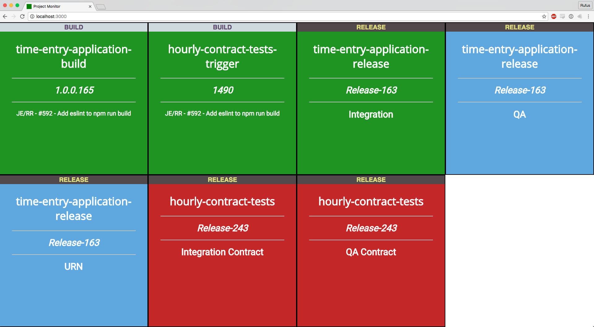

# build-mon

A simple project monitor to display the status of Visual Studio Online builds and releases.

## Usage

Install [Leiningen](http://leiningen.org/)

Obtain a personal access token for Visual Studio Online with two permissions boxes ticked:

- **Build (read)** for dispaying build status
- **Code (read)**  for displaying commit messages (optional)

Run app:

    lein run "VSO_ACCOUNT_NAME" "VSO_PROJECT_NAME" "VSO_PERSONAL_ACCESS_TOKEN"

Visit [localhost:3000](http://localhost:3000)

## Run on [Heroku](https://heroku.com)

A Procfile is included for simple deployment to Heroku.

- Create a new app in Heroku.
- Push this repository to it.
- Set the Config Variables in the app settings:

        VSO_ACCOUNT_NAME
        VSO_PROJECT_NAME
        VSO_PERSONAL_ACCESS_TOKEN

## Development

Run tests:

    lein midje [:autotest]
