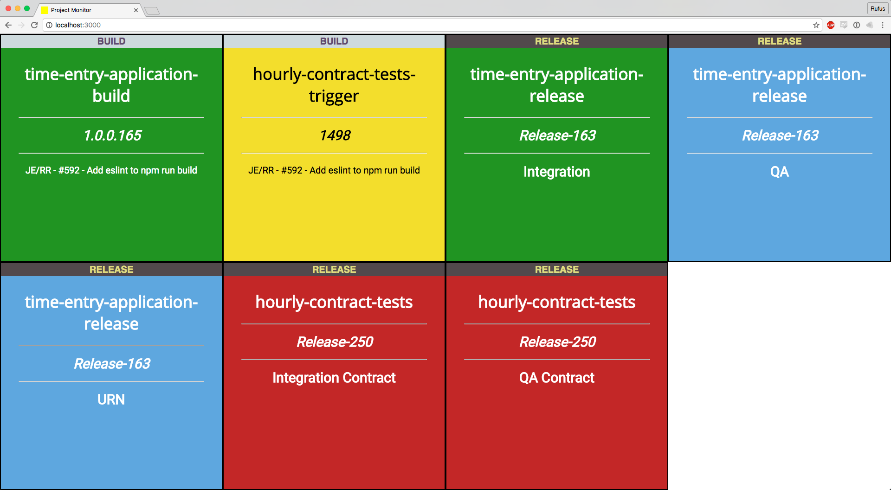

# build-mon

A simple build monitor to display the status of Visual Studio Online builds and releases.

## Usage

- Find your account name and project name from your Visual Studio Online url:

        https://{VSO_ACCOUNT_NAME}.visualstudio.com/{VSO_PROJECT_NAME}

- Obtain a personal access token for Visual Studio Online with the following permissions boxes ticked:

    - **Build (read)** for displaying status of builds
    - **Release (read)** for displaying status of releases
    - **Code (read)**  for displaying commit messages (optional)

#### Run with Java

- Install Java
- Download the [release jar file](https://github.com/elrob/build-mon/releases/download/v0.2.0/build-mon-0.2.0-standalone.jar)
- Run app:

        java -jar build-mon-0.2.0-standalone.jar "{VSO_ACCOUNT_NAME}" "{VSO_PROJECT_NAME}" "{VSO_PERSONAL_ACCESS_TOKEN}"

- Visit [localhost:3000](http://localhost:3000)

#### Run with Leiningen

- Install [Leiningen](http://leiningen.org/)
- Clone this repository
- Run app:

        lein run "{VSO_ACCOUNT_NAME}" "{VSO_PROJECT_NAME}" "{VSO_PERSONAL_ACCESS_TOKEN}"

- Visit [localhost:3000](http://localhost:3000)

#### Run on [Heroku](https://heroku.com)

A Procfile is included for simple deployment to Heroku.

- Create a new app in Heroku.
- Push this repository to it.
- Set the Config Variables in the app settings:

        VSO_ACCOUNT_NAME
        VSO_PROJECT_NAME
        VSO_PERSONAL_ACCESS_TOKEN

## Development

Run tests:

    lein midje [:autotest]

Run code analysis and tests:

    lein test

#### TODO:

- reinstate error handling on front end (was removed from `refresh.js`) - VSO api sometimes goes down and it is useful to get some feedback in the browser
- add any missing tests / update current tests to cover any untested functionality
- add tests for releases stuff
- refactor and break out core.clj as it has become too cumbersome

